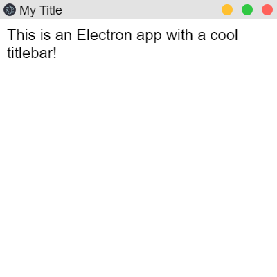

# ElectronJS - Custom Titlebar
Hey there! I have been working on a few Electron applications recently, but I find the system default titlebars to be "too simple" and they're not even customizable! If you are convinced by the idea of making a customizable titlebar, to "replace" the default one, worth continue reading!

### How does it look?


## Tutorial
Let's get started how do we make a custom titlebar in Electron.
In this tutorial, we will start making the app from scratch.

### Setting up project

* Initialize Project. Let's make a new dir and initialize project there
```bash
mkdir custom-titlebar
cd custom-titlebar
npm init -y
```

* Installing Electron. I don't think I need to explain this!
```bash
npm i electron --save-dev
```

* Make two new files - app.js and client/index.html (Yes, in new dir "client", just for the sake of keeping this structured). This file would be the root of the program. On Linux and macOS, we can just do:
```bash
touch app.js
mkdir client
cd client
touch index.html
```
_Let's come out of that dir..._
```bash
cd ..
```

* Add some code. Well this is basic. We just make a simple Electron app here.
  * app.js
  ```js
  const { app, BrowserWindow } = require('electron')

  const createWindow = () => {
      const win = new BrowserWindow({
          width: 400,
          height: 400,
          webPreferences: {
              nodeIntegration: true,
          }
      })

      win.loadFile('./client/index.html') // Load the main client file
  }

  app.whenReady().then(createWindow)

  app.on('window-all-closed', () => {
      if (process.platform !== 'darwin') {
          app.quit()
      }
  })

  app.on('activate', () => {
      if (BrowserWindow.getAllWindows().length === 0) {
          createWindow()
      }
  })
  ```
  * client/index.html
  ```html
  <!doctype html>
  <html lang="en-US">

  <head>
      <meta charset="utf-8"/>
      <title>Hello Electron</title>
  </head>

  <body>
      Hello!
  </body>

  </html>
  ```
  You must have seen a simple page saying "Hello!" if you did everything right.

### Moving on to Titlebar
* Let's move on. What do we need now? A custom titlebar. For that, we will remove the current one. And for removing it, we will set "frame: false" in app options. Note that this also removes the menubar! In my case, I didn't need it. Your app options would look something like this:
```js
const win = new BrowserWindow({
    width: 400,
    height: 400,
    frame: false,
    webPreferences: {
        nodeIntegration: true,
    }
})
```
* Try running the app now. You would see a window, without a titlebar (and frame too!). If you wonder how'd you close the app (that's.. easy), just use `Crtl + C` in Terminal (or whatever you call it). Run using:
```bash
npx electron app.js
```

### Adding a titlebar
Let's add a titlebar now, since we don't have one! For this, we will use some CSS _magic_!
* Go to your client/index.html, clean up the body, I mean, remove the Hello part.
* Add two new div elements, with IDs "titlebar" and "app" respectively. Here's how it'd look:
  ```html
  <body>
      <div id="titlebar"></div>
      <div id="app"></div>
  </body>
  ```
* Now we have two divs, one is titlebar, another one is our actual app - which holds everything else than the titlebar (of corsi). What does a basic titlebar have? An icon, a title, and the three buttoms to close, maximize/restore, minimize the window. Let's make those now.
* In the #titlebar div, we will add some new elements
  * Icon. For an icon, we will simply add a image (`img`). Don't forget to give it ID "icon"! We will later use these IDs as selectors of these elements to apply the magic, and also, set the source to an image you want as icon. I'm using "images/icon.png" (present in source of this repo), as the icon (src attribute!) here. Here's what you're going to add:
  ```html
  
  ```
  * Title. We will simply just add a span tag for it, with a "title text" in it. Also, give it ID "title"
  ```html
  <span id="title">My Title</span>
  ```
  * Adding the buttons. I'll keep this structured - making a new div with ID "titlebar-buttons" having three more divs inside it (yes, I love divs!). All of those will have a class "tb-btn" and IDs "tb-btn-close", "tb-btn-min" and "tb-btn-max". Here's howit looks like:
  ```html
  <div id="titlebar-buttons">
      <div id="tb-btn-close" class="tb-btn"></div>
      <div id="tb-btn-max" class="tb-btn"></div>
      <div id="tb-btn-min" class="tb-btn"></div>
  </div>
  ```
  Alright, so the titlebar elements are now _complete_. Let's move on to the app element to complete the HTML part.

* Adding application content. For this, I'll make a new div *outside* the div#titlebar, with ID "app". Later, we're going to add some CSS to position everything. For now, I'm just going to add "Hello!" in #app div.
```html
<div id="app">
    Hello!
</div>
```

### Styling the Titlebar
Now comes the CSS part! Let's make a new file, "client/style.css" (`cd client && touch style.css` on mac and Linux). Let's start styling.
Here we will make the titlebar with height 30px. Though, the code you will find in the source of this repo contains a flexible one, you can simply change the titlebar height in CSS Variables. For the sake of simplicity, I'll keep it constant in this tutorial.
We're declaring some "global" CSS variables (global since they're in :root, the document element itself)
```cs
:root {
    /* Our global variables */

    /* Titlebar Button colors */
    --tb-close: #FF625B;
    --tb-min: #FFC030;
    --tb-max: #30C843;

    /* Titlebar Background Color */
    --tb-bg: #E3E3E3; /* #414141 if you want dark mode! */
    /* App background color */
    --background: #ffffff; /* #313131 if you want dark mode! */
}
```
We have a #titlebar div. Let's add the following CSS for it (there are comments in /*  */ explaining what each line does):
```cs
#titlebar {
    position: fixed; /* Makes the position fixed instead of being positioned relatively to the other elements */
    /* Next two lines will set the position of the titlebar (top is y axis, left is x axis) to 0, 0 (origin if you forgot Cartesian plane) */
    top: 0px;
    left: 0px;
    /* Set the width to 100%. Completely cover it on x-axis. */
    width: 100%;
    /* Set the height to 30px */
    height: 30px;
    /* Background color of the titlebar, from our global CSS Variables (Grey-ish) */
    background-color: var(--tb-bg);
    /* User cannot select components in titlebar like image or text */
    -webkit-user-select: none;
    /* This property is used to tell Electron that this part is draggable and "is used as a titlebar" */
    -webkit-app-region: drag;
}
```
Now, we need the app to be positioned accordinly to the titlebar.
```css
#app {
    /* We're going to use a fixed position */
    position: fixed;
    /* Set the y axis to the titlebar height, that is 30px, since the titlebar is taking 30px from top, we're positioning this 30px down from top. */
    top: 30px;
    /* Set the y axis to top, since we'll maximize the width */
    left: 0px;
    /* Set width to "maximum" that is cover complete x axis */
    width: 100%;
    /* Calculate the height relative to the titlebar and window size. 100% is full height, and we subtract 30px since our app is positioned 30px from top. */
    height: calc(100% - 30px);
    /* Set background to our global CSS variable (white there) */
    background-color: var(--background);
    /* Set a padding to position text in a better way. */
    padding: 10px;
    /* Font size. Just for the text again. */
    font-size: 22px;
}
```
Alright, now we have the titlebar and app position correctly, but not the inner elements!
Let's position the titlebar's inner elements correctly.
We'll start with the icon and the title. We'll add the CSS for it:
```css
#icon {
    /* Position it absolute. Similar to fixed, but this positions the app "relative" to its parent's position only if the parent has postion fixed, absolute or relative! */
    position: absolute;
    /* Position it 4, 4 absolutely from the titlebar's position */
    top: 4px;
    left: 4px;
    /* Simply setting the height and width of it */
    height: calc(var(--tb-height) - 8px);
    width: calc(var(--tb-height) - 8px);
}

#title {
    /* Local variable, padding. */
    --padding: 5px;
    /* Calculate the font size from padding */
    font-size: calc(30px - calc(var(--padding) * 2));
    /* Just positioning it again */
    position: absolute;
    left: 30px;
    top: var(--padding);
}
```
Yes! Now our title and icon are ready. We just need to style our buttons now!
Let's move on to the buttons. I'm making it kinda mac-style, rounded and the same colors (as defined in global CSS Variables!)
```css
/* This class is common in all the titlebar buttons, so that we don't have to repeat CSS code in all those buttons. It simply makes a rounded button with absolute position. */
.tb-btn {
    --padding: 6px;
    height: calc(var(--tb-height) - calc(var(--padding) * 2));
    width: calc(var(--tb-height) - calc(var(--padding) * 2));
    position: absolute;
    top: var(--padding);
    margin-right: var(--padding);
    border-radius: 100%;
    cursor: pointer;
    -webkit-app-region: no-drag;
}

/* Lower the brightness when user hovers on the button */
.tb-btn:hover {
    filter: brightness(50%);
}

/* The below CSS code will simply apply position and color to the separate buttons */

#tb-btn-close {
    right: 0px;
    background-color: var(--tb-close);
}

#tb-btn-max {
    right: calc(var(--tb-height) + 1px);
    background-color: var(--tb-max);
}

#tb-btn-min {
    right: calc(calc(var(--tb-height) * 2) + 2px);
    background-color: var(--tb-min);
}
```
We've completed the designing part! Now try running the app. `npx electron app.js` in case you forgot.
But wait... the buttons don't work! We'll need some JavaScript for it.
Let's make a new script, client/script.js.
Add the followin code (explained in "comments"):
```js
// Here we declare the "win" variable on client side
// Since we have nodeIntegration enabled, we can use require
// We use require("electron").remote because its designed to run on renderer process
// which is the client side. Note that we cannot use remote module unless "enableRemoteModule" is true in app options
// BrowserWindow is a class in electron module, it has a static method "getFocusedWindow"
// which gives you current focused window (or simply, the one user is on at the moment)
const win = require("electron").remote.BrowserWindow.getFocusedWindow();

// Since we removed the real titlebar, we no longer have these basic buttons there
// We have to code them manually, though not really too much work.
// Close the window using BrowserWindow#close
const closeWindow = () => win.close();
// Minimize the window using BrowserWindow#minimize
const minimizeWindow = () => win.minimize();
// Now this one checks if the window is already maxmized,
// If it is, then it restores the window to last "un-maxmized" state (BrowserWindow#restore)
// Else it will maximize the window (BrowserWindow#maximize)
const maximizeWindow = () => win.isMaximized() ? win.restore() : win.maximize();
```
And link it to the app by adding:
```html
<script src="./script.js"></script>
```
at the end of body.
For the functions to be actually get called, we will have to add onclick attributes to the buttons, like this:
```html
<div id="tb-btn-close" onclick="closeWindow()" class="tb-btn"></div>
<div id="tb-btn-max" onclick="maximizeWindow()" class="tb-btn"></div>
<div id="tb-btn-min" onclick="minimizeWindow()" class="tb-btn"></div>
```
It still won't work. We're using remote module in the client side (renderer process), but its not enabled by default. Go to app.js, and change app config to this:
```js
const win = new BrowserWindow({
    width: 400,
    height: 400,
    frame: false,
    webPreferences: {
        nodeIntegration: true,
        enableRemoteModule: true, // <-- we added this
    }
})

```
We're done with this! Now run the app:
```bash
npx electron app.js
```
And you'll see a window with working custom titlebar!
Source code can be found in this repo itself. The repo's code has a bit more flexible titlebar of which height can be customized with a single CSS Variable. If you had any issues, just open a issue!
I hope you enjoyed reading :3